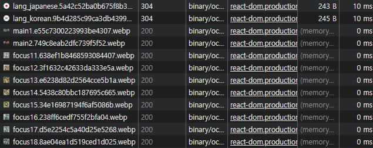

## 문제발생
---
운영 페이지 성능을 위해 `png` → `webp`파일로 변경 후 다시 배포를 했지만 배포 후 관리자모드의 **`Network`**탭을 확인해보니 `webp`파일의 Type이 전부 `image/webp`가 아닌 `binary/octet-stream`라고 표시되는 문제가 발생했습니다.



AWS S3에 분명 `webp`파일로 배포를 했음에도 이미지만 정상적으로 잘 렌더링 될 뿐, Type이 `binary/octet-stream`라는것을 보면 뭔가 잘못 되었다고 생각했습니다.

그래서 AWS S3 버킷에 배포된 `webp`이미지 파일의 메타데이터도 확인해보았는데 Content-Type이 `binary/octet-stream`라고 표시되어 있는것을 확인할 수 있었습니다.


## 원인
---
`binary/octet-stream`은 파일의 MIME 타입이 명확하지 않을 때 사용하는 기본값입니다. 즉, MIME 타입 설정이 제대로 되지 않아서 브라우저가 자동으로 MIME 타입을 감지해서 `binary/octet-stream`으로 설정해버려서 Content-Type이 `binary/octet-stream`으로 자동으로 설정해버린 것입니다.

## 해결방법
---
현재 Git에 배포 시 AWS CLI 방식으로 AWS S3에 자동배포하고 있기 때문에 배포 방식을 변경했습니다.
- 변경 전

```yaml
image: node:latest
stages:
  - build
  - deploy
cache:
  paths:
    - node_modules/
build:
  stage: build
  tags:
    - photomagstudio-runner
  script:
    - npm install
    - CI=false npm run build
  artifacts:
    expire_in: 1 hour
    paths:
      - build

deploy-to-s3:
  image: garland/aws-cli-docker
  stage: deploy
  tags:
    - photomagstudio-runner
  script:
    - aws s3 sync build s3://www.photomagstudio.com
  only:
    - main
purge:
  image: garland/aws-cli-docker
  stage: deploy
  script:
    - aws cloudfront create-invalidation --distribution-id [CloudFront의 고유ID] --paths "/*"
  only:
    - main
```

현재 상태는 Git에 배포될 때 `deploy-to-s3`를 통해 **AWS S3에 자동배포**가 되는데, 이 상태에서 배포를 하면 이미지가 `png`나 `jpg`같은 경우는 AWS에서 자동으로 `image/png`, `image/jpg`로 Content-Type이 변경되지만, `webp`파일은 자동으로 `image/webp`로 지정되지 않기 때문에 AWS S3 버킷에 업로드된 `webp`파일들의 MIME 타입을 `image/webp`로 수정하여 배포하도록 설정해야 합니다.

- 변경 후

```yaml
...
deploy-to-s3:
  image: garland/aws-cli-docker
  stage: deploy
  tags:
    - photomagstudio-runner
  script:
    - aws s3 sync build s3://www.photomagstudio.com
    - for file in $(aws s3 ls s3://www.photomagstudio.com/ --recursive | awk '{print $4}' | grep '\.webp$'); do
        aws s3 cp "s3://www.photomagstudio.com/$file" "s3://www.photomagstudio.com/$file" --content-type "image/webp" --metadata-directive REPLACE;
      done
  only:
    - main
...
```

### 코드 설명
---
```yaml
for file in $(aws s3 ls s3://www.photomagstudio.com/ --recursive | awk '{print $4}' | grep '\.webp$'); do
```

1. `aws s3 ls s3://www.photomagstudio.com/ --recursive`
- S3 버킷 `www.photomagstudio.com`의 모든 파일을 재귀적으로 나열

```bash
2024-12-18 15:30:12  12345 path/to/image1.webp
2024-12-18 15:30:12  54321 path/to/image2.webp
```

2. `awk '{print $4}'`
- 나열된 파일 리스트에서 파일 경로만 추출
- `$4`는 입력된 데이터의 네 번째 필드를 의미
- 첫 번째 필드: 날짜 (2024-12-18)
- 두 번째 필드: 시간 (15:30:12)
- 세 번째 필드: 파일 크기 (12345, 54321)
- 네 번째 필드: 파일 경로 (path/to/image1.webp, path/to/image2.webp)

```bash
path/to/image1.webp
path/to/image2.webp
```

3. `grep '\.webp$'`
- `.webp` 확장자로 끝나는 파일만 필터링
- 끝에 `do`는 실행

```bash
image1.webp
image2.webp
```

4. `for file in $(...)`
- `.webp` 파일 목록을 순차적으로 처리하기 위한 루프

## 결과
---


AWS CLI 방식을 변경 후 AWS S3에 다시 배포한 결과 관리자 모드의 `Network`탭에 Type이 `binary/octet-stream` → `webp`으로 잘 변경이 되었습니다!

참고로, `webp`파일만 찾아서 `image/webp`으로 Type을 변경하는 것이기 때문에 원래 잘 변경됐던 `png`나 `jpg`같은 경우는 그대로 `image/png`, `image/jpg`로 잘 나옵니다.

<!-- > Add Markdown syntax content to file `_tabs/about.md`{: .filepath } and it will show up on this page.
{: .prompt-tip } -->