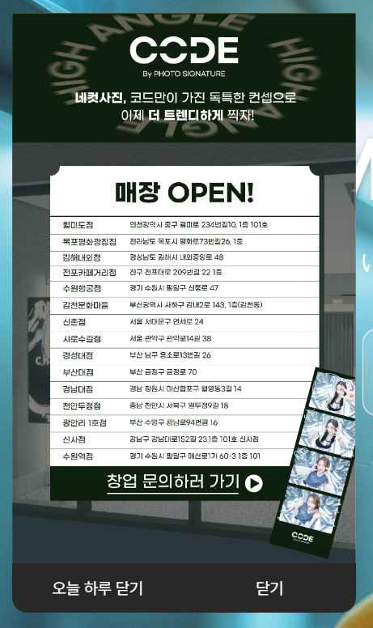

## 결과 미리보기
---



프로젝트를 하던 중, 메인 페이지 진입 시 리액트에서 팝업창(모달 레이어)을 노출시켜야 한다는 요구사항이 있었고, 요구사항에 따라 `react-modal`을 통해 만든 팝업창 결과입니다.

## 모달창을 만드는 방법?
---
리액트에서 모달창을 만들기 위한 방법은 2가지입니다. 하나는 직접 만드는 방법과 다른 하나는 리액트의 라이브러리를 이용하여 만드는 방법입니다.

리액트는 모달창을 만들기위한 라이브러리를 지원하기 때문에 비교적 쉽게 팝업창을 만들 수 있습니다.

### react-modal 설정 및 세팅
---
- `react-modal` 패키지 설치

```bash
npm install react-modal
```

- PopupLayer 컴포넌트 생성

```javascript
import React, { useState } from "react";
import Modal from "react-modal";

Modal.setAppElement("#root");

function PopupLayer() {
		return (
				...
		)
}
export default React.memo(PopupLayer);
```

여기서 `Modal.setAppElement("#root");`을 반드시 써줘야하는데, `react-modal`은 기본적으로 접근성을 지원하므로 `setAppElement`를 사용하여 루트 요소를 설정해야할 필요가 있습니다.
> 일반적으로 루트 요소는 `#root`입니다.
{: .prompt-tip }

- 모달 스타일

```javascript
import React, { useEffect } from "react";
import Modal from "react-modal";
import { Link } from "react-router-dom";
import styled from "styled-components";
import popupImg from "../assets/images/home/popup_sample.png"

Modal.setAppElement("#root");

const ModalWrapper = styled.div`
  box-sizing: border-box;
  display: ${props => props.$isOpen ? 'block' : 'none'};
  position: absolute;
  top: 100px;
  left: 30px;
  z-index: 10;
  outline: 0;
  width: 340px;
  height: 593px;
`;
const ModalWrap = styled.div`
  display: flex;
  flex-direction: column;
  align-items: center;
	width: 100%;
	height: 100%;
`;
const ImgWrap = styled.div``;
const Footer = styled.div`
  display: flex;
  justify-content: space-between;
  background-color: #282828;
  width: 100%;    
  border-radius: 0 0 15px 15px;
  color: #ffffff;
`;
const Close = styled.div`
	display: flex;
	justify-content: center;
	align-items: center;
	width: 100%;
	cursor: pointer;
	padding: 15px;
	transition: transform 0.2s ease, background-color 0.2s ease, color 0.2s ease;
	&:hover {
		background-color: #343434;
		color: #fff;
	}
`;
const ModalInner = styled.div`
  box-sizing: border-box;
  position: relative;
  max-width: 480px;
	width: 100%;
	height: 100%;
`;
```

- 오늘 하루 닫기 기능

``` javascript
function PopupLayer({ isOpen, onClose, closable }) {

  if (!isOpen) return null;

  // 이전 방문 날짜
  const VISITED_BEFORE_DATE = localStorage.getItem("popupVisitCookie");
  // 현재 날짜
  const VISITED_NOW_DATE = new Date().toISOString().split("T")[0];
  
  useEffect(() => {
  	console.log(VISITED_BEFORE_DATE);
  	console.log(VISITED_NOW_DATE);
  }, [VISITED_BEFORE_DATE, VISITED_NOW_DATE]);
  
  useEffect(() => {
  	if (VISITED_BEFORE_DATE !== null) {
  		if (VISITED_BEFORE_DATE === VISITED_NOW_DATE) {
  			localStorage.removeItem("popupVisitCookie");
  			onClose(true);
  		} else {
  			onClose(false);
  		}
  	}
  }, [VISITED_BEFORE_DATE]);
  
  const dayClose = () => {
  	if (onClose) {
  		const tomorrow = new Date();
  		tomorrow.setDate(tomorrow.getDate() + 1);
  		const expiryDate = tomorrow.toISOString().split("T")[0];
  		localStorage.setItem("popupVisitCookie", expiryDate);
  		onClose(false);
  	}
  };
  
  return (
    <ModalWrapper $isOpen={isOpen}>
      <ModalInner>
        <ModalWrap>
          <ImgWrap>
            <Link to="/brand" rel="noopener noreferrer" target={'_blank'} cursor="pointer">
              
            </Link>
          </ImgWrap>
            {closable && (
              <Footer>
                <Close onClick={dayClose} style={{ borderRadius: "0 0 0 15px" }}>
                  <span>오늘 하루 닫기</span>
                </Close>
                <Close onClick={onClose} style={{ borderRadius: "0 0 15px 0" }}>
                  <span>닫기</span>
                </Close>
              </Footer>
            )}
        </ModalWrap>
      </ModalInner>
    </ModalWrapper>
  );
};
export default React.memo(PopupLayer);
```

오늘 하루 닫기는 보통 쿠키나 `localStorage`를 사용하는 방법이 있는데, 쿠키는 직접 import를 해야하지만, `localStorage`같은 경우는 import없이 `getItem()`으로 바로 사용할 수 있습니다. 그래서 여기서는 `localStorage`를 사용했습니다.

- 팝업 레이어의 동작 방식
1. `closable`이 `true`일때만 닫기 버튼 활성화
2. “오늘 하루 닫기” 클릭 시 `VISITED_BEFORE_DATE`가 `null`이 아니면 `localStorage`에 `popupVisitCookie`라는 저장소에 내일 날짜까지 만료일을 저장
3. “닫기”를 클릭 시 그냥 닫기

- 팝업 레이어 호출

```javascript
export default function Main() {
    const [isOpenModal, setIsOpenModal] = useState(true);

    const closeModal = () => {
        setIsOpenModal(false);
    };
    
    return (
		    ...
        {isOpenModal &&
            <PopupLayer isOpen={isOpenModal} onClose={closeModal} closable={true} />
        }
    )
}
```

팝업 레이어 컴포넌트를 불러오면 완성!