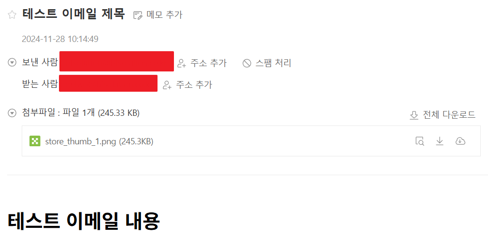

프로젝트를 하던 중, 메일 전송 기능을 개발해야되는 요구사항을 받았습니다. 그래서 Spring Boot와 AWS SES를 활용해 메일을 보내는 방법을 정리하고자 글을 쓰게 되었습니다.

## AWS SES란?
---
AWS(Amazon Web Services)에서 제공하는 클라우드 기반 이메일 전송 서비스입니다. AWS SES는 유료 서비스로, 애플리케이션이 이메일을 쉽게 보낼 수 있도록 지원하며, 마케팅 이메일, 알림 이메일, 거래 이메일 발송에 사용할 수 있습니다.

> 스프링 부트와 AWS SES를 사용하려면 `https://aws.amazon.com/ko/free`에서 `accessKey`와 `secretKey`를 발급받아야 합니다.
{: .prompt-tip }

## 스프링 부트에서 SES를 사용하기
---
### Step 1. 의존성 추가
---

```java
implementation 'org.springframework.boot:spring-boot-starter-mail' // 스프링부트 메일기능
implementation 'com.amazonaws:aws-java-sdk-ses:1.12.537' // SES 사용
```

### Step 2. yml설정
---

```yaml
cloud:
  aws:
    stack:
      auto: false
    credentials:
      useDefaultChain: false
      accessKey: 발급받은 accessKey
      secretKey: 발급받은 secretKey
    region:
      static: ap-northeast-1
```

`region`은 AWS 데이터 센터가 위치한 전 세계의 물리적 위치
- `ap-northeast-1`: 아시아 태평양 (도쿄)
- `ap-northeast-2`: 아시아 태평양 (서울)

### Step 3. SES 설정
---

```java
@Configuration
public class AwsSesConfig {

    @Value("${cloud.aws.region.static}")
    private String region;

    @Value("${cloud.aws.credentials.accessKey}")
    private String accessKey;

    @Value("${cloud.aws.credentials.secretKey}")
    private String secretKey;

    @Bean
    public AmazonSimpleEmailService amazonSimpleEmailService() {
        final BasicAWSCredentials basicAWSCredentials = new BasicAWSCredentials(accessKey, secretKey);
        final AWSStaticCredentialsProvider awsStaticCredentialsProvider = new AWSStaticCredentialsProvider(
                basicAWSCredentials);

        return AmazonSimpleEmailServiceClientBuilder.standard()
                .withCredentials(awsStaticCredentialsProvider)
                .withRegion(region)
                .build();
    }
}
```

### Step 4. MailReqDTO
---
메일 전송에 필요한 정보를 담는 DTO

```java
@Data
public class MailReqDTO {
    private String subject;
    private String name;
    private String filePath;
    private String email;
    private String iqryCn;
    private String coNm;
    private String to;
    private String from;
}
```

### Step 5. SesMailService
---

```java
@Service
public class SesMailService {

    @Autowired
    private AmazonSimpleEmailService amazonSimpleEmailService;

    public SendRawEmailRequest sendEmail(MailReqDTO mailReqDTO) throws MessagingException, IOException {
        MimeMultipart mimeMultipart = new MimeMultipart("mixed");

        // HTML 본문 생성
        MimeBodyPart htmlPart = new MimeBodyPart();
        htmlPart.setContent(mailReqDTO.getIqryCn(), "text/html; charset=UTF-8");
        mimeMultipart.addBodyPart(htmlPart);

        // 이메일 메시지 생성
        MimeMessage message = new MimeMessage(Session.getDefaultInstance(new Properties()));
        message.setSubject(mailReqDTO.getSubject());
        message.setFrom(new InternetAddress(mailReqDTO.getFrom()));
        message.setRecipients(Message.RecipientType.TO, InternetAddress.parse(mailReqDTO.getTo()));

        // 첨부파일
        if (mailReqDTO.getFilePath() != null && !mailReqDTO.getFilePath().isEmpty()) {
            MimeBodyPart attachmentPart = new MimeBodyPart();
            FileDataSource fds = new FileDataSource(mailReqDTO.getFilePath());
            attachmentPart.setDataHandler(new DataHandler(fds));
            attachmentPart.setFileName(fds.getName());
            mimeMultipart.addBodyPart(attachmentPart);
        }

        // 최종 이메일 설정
        message.setContent(mimeMultipart);

        // 이메일 메시지를 AWS SES로 변환
        ByteArrayOutputStream outputStream = new ByteArrayOutputStream();
        message.writeTo(outputStream);
        RawMessage rawMessage = new RawMessage(ByteBuffer.wrap(outputStream.toByteArray()));

        return new SendRawEmailRequest(rawMessage);
    }
}
```

### Step 6. 메일 테스트 & 테스트 결과
---

```java
@Service
public class SendMailService {
    @Autowired
    private AmazonSimpleEmailService amazonSimpleEmailService;

    @Autowired
    private SesMailService sesMailService;

    public void testSendMail() throws MessagingException, IOException {
        MailReqDTO mailReqDTO = new MailReqDTO();
        mailReqDTO.setFrom("보내는 사람의 메일"); // 보내는 사람의 인증된 메일
        mailReqDTO.setTo("받는 사람의 메일"); // 받는 사람의 메일(도메인 인증 필수)
        mailReqDTO.setSubject("테스트 이메일 제목");
        mailReqDTO.setIqryCn("<h1>테스트 이메일 내용</h1>");
        mailReqDTO.setFilePath("/Users/user/store_thumb_1.png");

        System.out.println("=== 이메일 전송 테스트 시작 ===");
        System.out.println("발신자: " + mailReqDTO.getFrom());
        System.out.println("수신자: " + mailReqDTO.getTo());
        System.out.println("제목: " + mailReqDTO.getSubject());
        System.out.println("본문 내용: " + mailReqDTO.getIqryCn());
        System.out.println("첨부파일 경로: " + mailReqDTO.getFilePath());
        System.out.println("=== 이메일 생성 완료, 전송 시도 ===");

        try {
            SendRawEmailRequest request = sesMailService.sendEmail(mailReqDTO);
            System.out.println("SendRawEmailRequest 생성 완료");
            amazonSimpleEmailService.sendRawEmail(request);
            System.out.println("amazonSimpleEmailService.sendRawEmail 호출 완료");
            System.out.println("=== 이메일 전송 성공 ===");
        } catch (Exception e) {
            System.out.println("=== 이메일 전송 실패 ===");
            System.err.println("에러 메시지: " + e.getMessage());
            e.printStackTrace();
        }
    }
}
```

`SendMailServer`를 만든 뒤 호출한 결과

- 로그


- 결과



메일이 정상적으로 보내지는 것을 확인할 수 있습니다!
