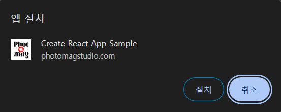

앱 설치 팝업은 프로젝트의 `mainfest.json`파일과 연관이 있는데 해당 파일은 웹 애플리케이션의 **PWA(Progressive Web App)** 설정을 정의하는 JSON 파일입니다.

요약하자면, 앱의 메타데이터를 포함하여 브라우저가 웹 애플리케이션을 "**설치 가능**"한 앱처럼 인식하도록 도와줍니다.
- mainfest.json

```json
{
  "name": "My Web App",            // 앱의 전체 이름
  "short_name": "MyApp",           // 축약 이름 (홈 화면에서 표시)
  "icons": [                       // 앱 아이콘 목록
    {
      "src": "/icon-192x192.png",  // 아이콘 경로
      "sizes": "192x192",
      "type": "image/png"
    },
    {
      "src": "/icon-512x512.png",
      "sizes": "512x512",
      "type": "image/png"
    }
  ],
  "start_url": "/",                // 앱 실행 시 기본 경로
  "display": "standalone",         // 표시 모드 (standalone, fullscreen, browser 등)
  "background_color": "#ffffff",   // 앱 초기 화면의 배경색
  "theme_color": "#000000"         // 브라우저 테마 색상
}
```

`mainfest.json`파일의 기본값으로 제공되는 코드로, 앱 실행 시 표시될 설정값들을 설정할 수 있습니다.

## PWA(Progressive Web App)?
---
브라우저에서 실행되지만, 설치나 오프라인 사용 등 네이티브 앱과 비슷한 기능을 제공합니다. 즉, 웹 기반이지만 앱처럼 사용 가능하게 만드는 기술입니다.

## 앱 설치 제거
---

### 제거방법1
---
보통 `mainfest.json`파일은 `/public/mainfest.json`경로에 있으므로 해당 경로에서 mainfest.json파일을 클릭합니다.

```json
{
  "start_url": "/",                // 앱 실행 시 기본 경로
  "display": "standalone",         // 표시 모드 (standalone, fullscreen, browser 등)
  "background_color": "#ffffff",   // 앱 초기 화면의 배경색
  "theme_color": "#000000"         // 브라우저 테마 색상
}
```

`mainfest.json`파일에서 display속성에 `standalone`를 `browser`로 변경합니다.

```json
{
  "start_url": "/",                // 앱 실행 시 기본 경로
  "display": "browser",         // 표시 모드 (standalone, fullscreen, browser 등)
  "background_color": "#ffffff",   // 앱 초기 화면의 배경색
  "theme_color": "#000000"         // 브라우저 테마 색상
}
```



앱 설치 버튼이 제거된 것을 확인할 수 있습니다.

### 제거방법2
---
웹에서 앱 설치가 필요없을 때 가장 간단하게 리액트에서 앱 설치 버튼을 제거하는 방법은 `index.html`에서 `mainfest.json`파일이 기본적으로 연결이 되어있을 건데 이 부분을 주석처리합니다.

```html
<!-- <link rel="manifest" href="%PUBLIC_URL%/manifest.json" /> -->
```

이후 웹을 확인해보면 앱 설치 버튼이 제거된 것을 볼 수 있습니다.
